# LiteHost

DAWを開くほどではない、という人向けの軽量 **VST3** ホストです。録音もタイムラインもありません。トラックを足して入力を選び、エフェクトを挿して鳴らすだけです。

> **VST2 には対応しません。** Steinberg による VST2 の新規ライセンス終了／配布制限のため、本ソフトは VST3（および将来の拡張）のみを対象とします。VST2 プラグインは読み込めません。

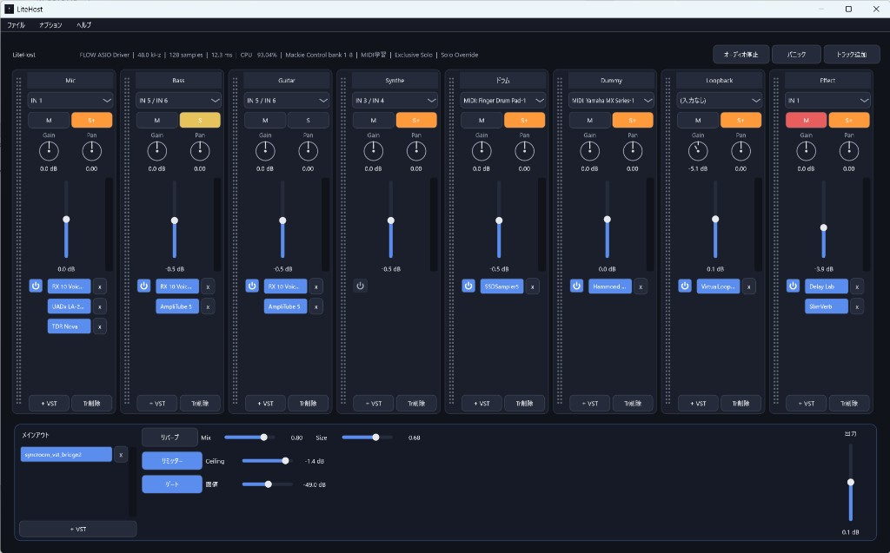

## できること

- オーディオインターフェイスの入力をトラックごとに指定。MIDI 入力機器も指定でき、シンセ／ドラム音源を発音可能（`MIDI: すべて` で全入力）
- 各トラックとメインアウトに VST3 を **最大 10 個まで** 直列挿入。プラグイン欄は縦スクロール可
- トラック名をドラッグして並べ替え。トラックの VST チップをドラッグで並べ替え／他トラックへ移動。**Ctrl+ドラッグ**でコピー（同トラック内の複製も可）
- **排他ソロ**（Cakewalk Exclusive Solo）と **Shift+ソロ**（Solo Override）を備える。排他ソロ ON では通常の S は1本だけ。Override したトラックは他をソロしても残る（**オプション → 一般**）
- **トラック並列処理**（既定 ON）で有効トラックの VST を複数コアに分散。占有率が上がる・音が欠けるときは OFF にできる（**オプション → 一般**。マスター VST は常に直列）
- メインアウトに簡易リバーブ、ノイズゲート、ピークリミッター（Ceiling **-4.0〜0.0 dB**、初期状態はオフ）、出力レベルフェーダー。専用プラグインほどの調整幅や音質は想定していない
- トラックに **Trim**（フェーダー前ゲイン、丸ノブ −24〜+24 dB）とパン（どちらもセンター印付きの丸ノブ）
- **オーディオ停止／開始**（過負荷時にエンジンを切って復帰）と **パニック**（鳴り続けるノートを All Notes Off で止める）
- **コントロールサーフェス**: Mackie Control / HUI / MMC（フェーダー・V-Pot=パン・Mute/Solo・バンク・再生/停止）（**オプション**メニュー）
- **MIDI 学習**: 任意 MIDI 入力の CC/Note を、トラックの Trim・フェーダー・パン・Mute・Solo と、メインフェーダー・リバーブ（On/Mix/Size）・リミッター（On/Ceiling）・ゲート（On/閾値）に割り当て（コントロールを右クリック）
- 初回起動時のデバイスタイプは Windows では **ASIO**、macOS では **Core Audio**。バッファは利用可能値のうち **128 前後** を選択（以後は前回の設定を復元）
- プロジェクトファイル（`.litehost`）でトラック構成・プラグイン・メイン設定を保存／読込
- ファイルメニューから新規・開く・保存・最近使ったプロジェクト。起動時は最後に開いたプロジェクトを復元。`LiteHost.exe path\to\project.litehost` でも開けます。編集は明示保存で、未保存時はタイトルに `*` が付く。終了時に未保存なら「変更を保存しますか？」を表示（はい＝保存して終了／いいえ＝破棄して終了／キャンセル＝終了しない）
- VST3 スキャンの標準対象は Windows の **64bit** `Common Files\VST3`（`Program Files (x86)` 配下は対象外）と macOS の `/Library/Audio/Plug-Ins/VST3`。ユーザー領域は対象外で、追加フォルダは **オプション → VST3 スキャン** で指定する
- VST3 スキャンは専用子プロセス `LiteHostScanner` で並列実行する（不良プラグインで本体が落ちにくい）。配布・手動配置時は **`LiteHost.exe` と同じフォルダ**に `LiteHostScanner.exe` を置く（macOS は `LiteHost.app/Contents/MacOS/` 内）
- ウィンドウ位置とサイズを記憶。GitHub に新しいリリースがあれば起動時に通知

信号の流れは次のとおりです。

`入力（オーディオ or MIDI） → トラック VST（最大10） → Trim → フェーダー／パン → ミックス → ゲート → リバーブ → メインフェーダー → ピークリミッター → メイン VST（最大10、SyncRoom など） → メイン出力`

## 仕様メモ

| 項目 | 内容 |
| ------ | ------ |
| プラグイン形式 | **VST3 のみ**（VST2 / AU は非対応。VST2 は製造元のライセンス制限による） |
| トラック／メインの VST 数 | 各チェイン最大 **10**（UI でも追加を制限） |
| VST3 スキャン | 子プロセス `LiteHostScanner` を最大 4 並列。固まったプラグインはスキップしてブラックリスト化（`knownPlugins.xml`） |
| プロジェクト | `Documents\LiteHost\*.litehost` など。明示的に保存（終了時の自動上書きはしない） |
| オーディオ設定 | Windows: `%AppData%\LiteHost\audio.xml` / macOS: `~/Library/Application Support/LiteHost/audio.xml` |
| プラグイン一覧 | 同上ディレクトリの `knownPlugins.xml`（ブラックリスト含む） |
| アプリ設定 | 同上ディレクトリの `settings.xml`（最終プロジェクト・最近・追加 VST パス・サーフェス・排他ソロ・トラック並列） |
| 内蔵リバーブ／リミッター | 簡易 DSP。リミッターは約 2ms ルックアヘッドのピーク抑制（Ceiling -4.0〜0.0 dB）。本格用途には VST を挿す |
| トラック並列処理 | 有効トラックの `process` をヘルパー＋オーディオスレッドで並列（マスターチェインは直列）。一般オプションで OFF 可 |

## ビルド

ソースは Windows / macOS 共通です。分岐は `#if JUCE_WINDOWS` / `#if JUCE_MAC` と CMake の OS 判定だけです。成果物だけ分かれます。

### Windows

Visual Studio 2022 以降（C++ ワークロード）が必要です。

```powershell
cd D:\Documents\Github\LiteHost
.\scripts\build.ps1
```

初回は JUCE を `third_party\JUCE` に取得するので時間がかかります。成功すると次ができます。

- `build\LiteHost_artefacts\Release\LiteHost.exe`
- `build\LiteHost_artefacts\Release\LiteHostScanner.exe`（本体の隣へ自動コピー）

**実行時は両方を同じフォルダに置いてください。** `LiteHostScanner.exe` が無いと VST3 スキャンできません。GitHub Release の Windows zip には両方含まれます。

未署名の exe を Windows Defender が `Bearfoos` などで誤検知し、削除することがあります。開発用なら管理者で `.\scripts\add-defender-exclusion.ps1` を一度実行し、`build`（と `dist`）を除外してください。

### macOS

Xcode と CMake が必要です。

```bash
./scripts/build-mac.sh
```

成功すると `build/LiteHost_artefacts/Release/LiteHost.app` ができます（中に `Contents/MacOS/LiteHostScanner` も同梱）。AU はまだホストしていません（VST3 のみで、Windows と同じ）

`master` への push と GitHub Release の公開時に、Actions が Apple Silicon 向け `LiteHost-*-macos-arm64.zip` を作り、同じバージョンのリリース（`vX.Y.Z`）へ添付します。未署名なので Gatekeeper が初回起動を止めることがあります。署名と公証は別途必要です。

GitHub の zip から展開した直後は、Gatekeeper の検疫属性で **VST3 スキャン用の子プロセスが起動できない**ことがあります。アプリ起動時に解除を試みますが、だめならターミナルで次を実行してください。

```bash
xattr -cr /path/to/LiteHost.app
```

Windows ではデバイスタイプに **ASIO** が出ます。JUCE 同梱の ASIO ヘッダを使用し、配布物は Steinberg ASIO SDK のライセンスに従う必要があります。独自 SDK を使う場合は `third_party\asiosdk` に置き、CMake の `JUCE_ASIO_USE_EXTERNAL_SDK` を有効化してください。

## 使い方

1. **ファイル** メニューでプロジェクトを新規作成／開く（または前回のプロジェクトが自動で開く）
2. 下の **オプション** 各項目でオーディオ・サーフェス・MIDI 学習・VST3・一般を整える
3. トラックの入力にオーディオ ch または **MIDI:** 機器を選び、**+ VST** でエフェクト／音源を最大 10 個まで挿す。チップをドラッグで並べ替え、または他トラックへ移動。**Ctrl+ドラッグ**でコピー
4. SyncRoom 連携はメインアウトの **+ VST** に SyncRoom の VST3 を挿す
5. 初回や環境のやり直しは **ヘルプ → セットアップウィザード**

### オプション → オーディオ設定

インターフェイス（Windows では ASIO 推奨）、サンプルレート、バッファ、入出力チャンネル、MIDI 入力機器を選びます。負荷で音が止まるときはヘッダーの **オーディオ停止／開始** でエンジンを切り直してください。ノートが鳴り続けるときは **パニック** で All Notes Off を送れます。

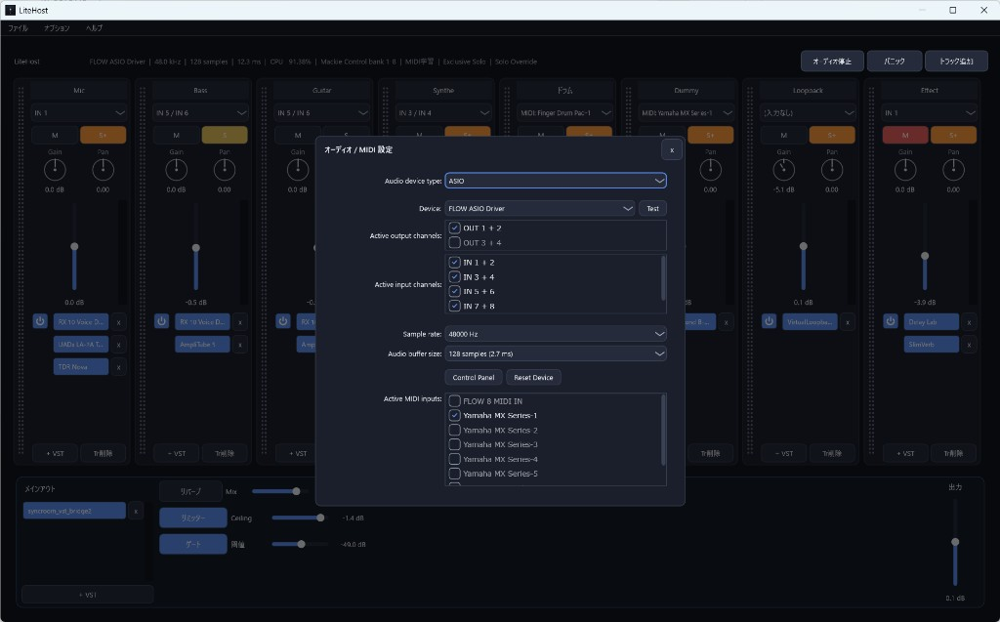

### オプション → サーフェス

Mackie Control / HUI / MMC 用の MIDI 入出力を演奏用とは別に指定します。NanoKontrol2 などは機器側を Mackie モードにしてから接続してください。フェーダー・V-Pot（パン）・Mute/Solo・バンク切り替えなどが使えます。

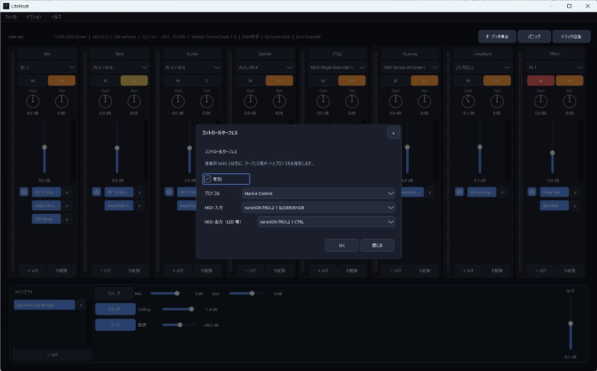

### オプション → MIDI 学習

学習用の MIDI 入力を有効にしたうえで、トラックの Trim／フェーダー／Pan／M／S、またはメインアウトのフェーダー・リバーブ・リミッター・ゲートを **右クリック** して CC／Note を割り当てます。「割り当てを全消去」で一括解除できます。

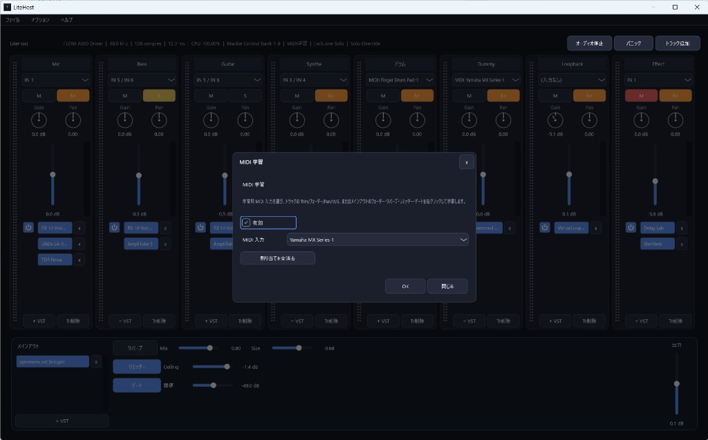

### オプション → VST3 スキャン

標準は **64bit** の `Common Files\VST3` のみです（macOS は `/Library/Audio/Plug-Ins/VST3`）。`Program Files (x86)\Common Files\VST3` など 32bit 向けフォルダは標準対象外です（64bit の LiteHost では読めず、スキャンが無駄に遅くなるため）。ユーザー領域などは追加フォルダとして登録できます。**VST2 フォルダを追加しても読み込み対象にはなりません。**

スキャンは `LiteHostScanner` 子プロセスを最大 4 並列で動かします。応答しないプラグインはスキップしてブラックリストに載せ、次回以降は飛ばします。`LiteHostScanner` が本体と同じ場所に無いとスキャンできません。

macOS で zip 展開直後にスキャンが進まない／スキャナ起動に失敗する場合は、Gatekeeper の検疫が原因のことが多いです。アプリ側でも解除を試みますが、だめなら `xattr -cr LiteHost.app` を実行してください。

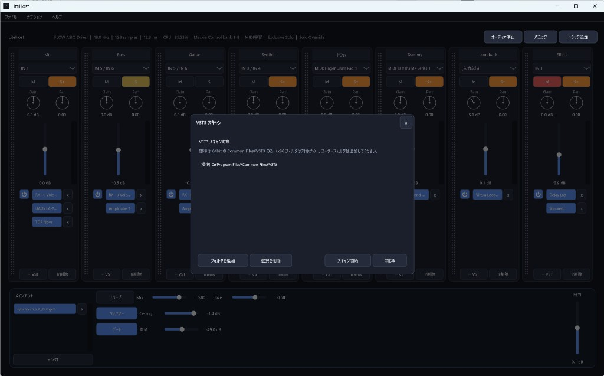

### オプション → 一般

**排他ソロ**（Exclusive Solo）と **トラック並列処理** の ON/OFF です。

- 排他ソロ ON のとき、通常のソロは1トラックだけ有効になり、Shift+ソロの Override は残ります。
- トラック並列処理 ON（既定）のとき、有効トラックの VST を複数コアで処理します。マスター VST（SyncRoom など）は常に直列です。CPU 占有が上がる・音が欠けるときは OFF にしてください。

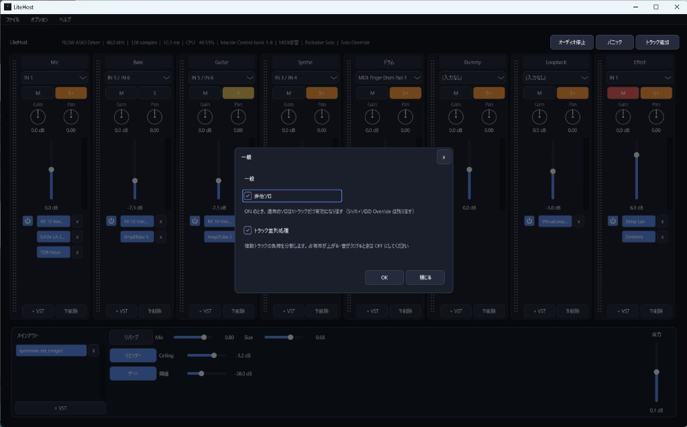

### ヘルプ → セットアップウィザード

初回セットアップと同じ流れを **5 ページ**でやり直せます（途中スキップ可。あとからこのメニューでも再度開けます）。

1. **ようこそ** — 軽いホストであることと、最初に整えるものの案内  
2. **オーディオと MIDI** — ASIO／バッファ／入出力／演奏用 MIDI  
3. **VST3 フォルダ** — スキャン対象の追加とスキャン（「次へ」だけではスキャンしない）  
4. **SyncRoom** — メインアウトへ SyncRoom VST を探して挿す（任意）  
5. **準備完了** — 使い方の要点

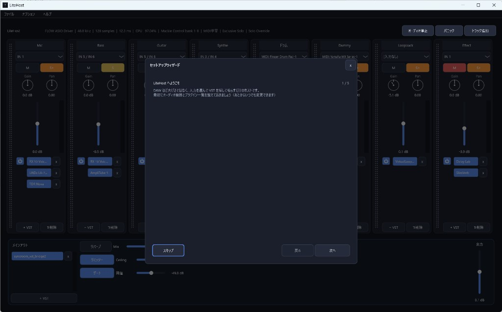

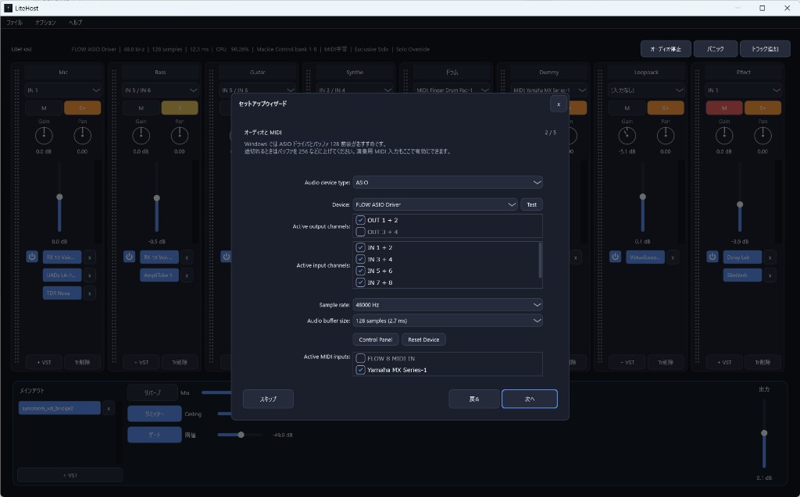

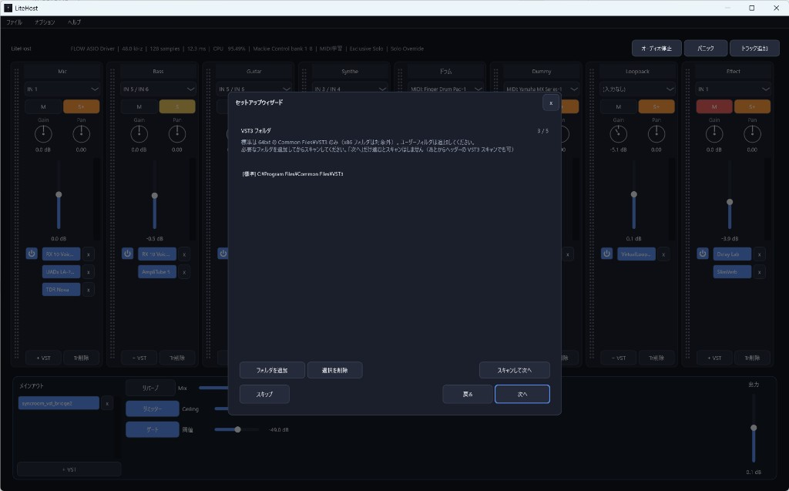

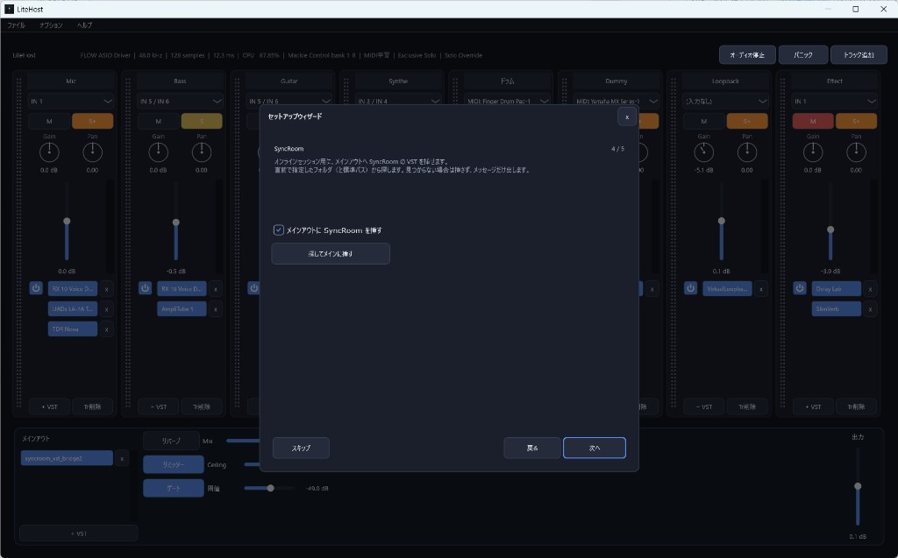

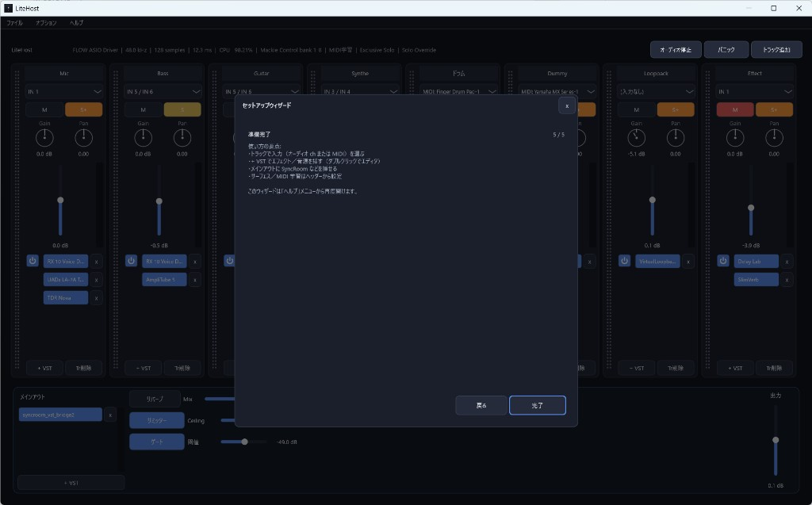

## ライセンス

LiteHost 本体のソースコードは [MIT License](LICENSE) です。

JUCE 9 は AGPLv3（または Raw Material Software の商用ライセンス）です。JUCE とリンクしたバイナリを配布する場合は、JUCE 側の条件にも従ってください。ASIO を含む配布は Steinberg のライセンスにも従う必要があります。
